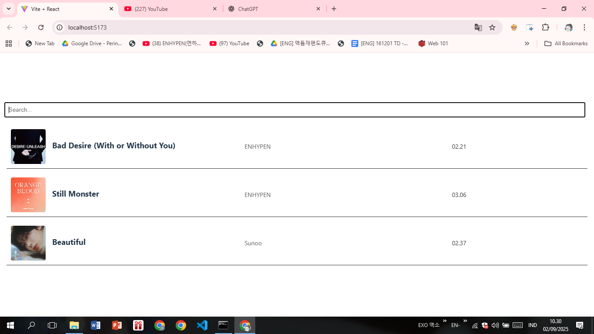
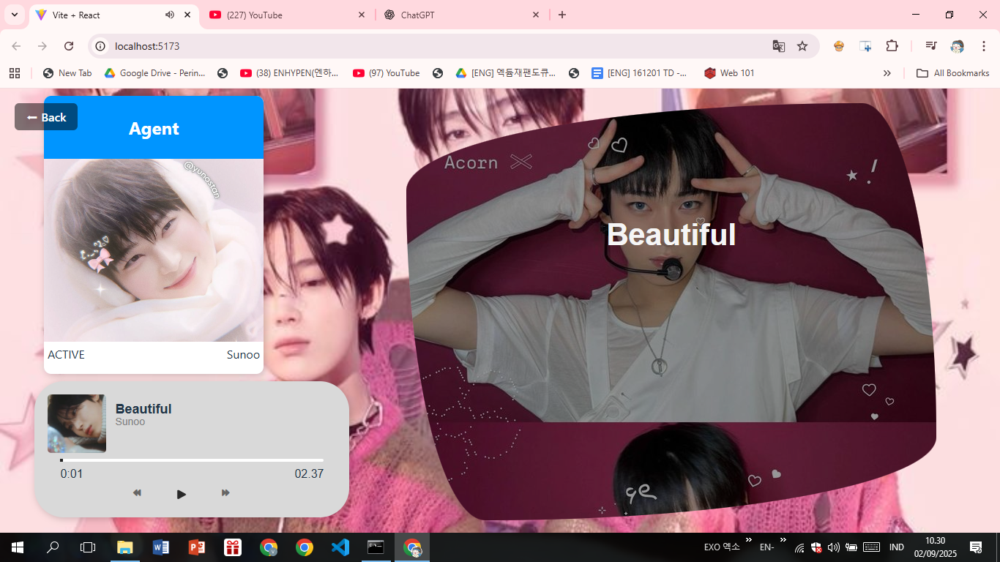

# 🎵 React Music Player Kpop especially Enhypen and Sunoo

A simple and elegant **Music Player** built with React.  
This allows users to play, pause, and navigate through songs with a clean and modern UI. It also features **synchronized lyrics** so you can sing along just like karaoke 🎤✨.  

---

## 🚀 Features
- 🎶 Play / Pause / Next / Previous track  
- 📀 Display album cover, song title, artist, and duration  
- 🎼 **Lyrics synchronization (karaoke mode)**  
- 🔍 Search and filter songs  
- 💖 Stylish UI with

---

## 🛠️ Tech Stack
- **React.js** (Frontend)  
- **JavaScript (ES6+)**  
- **CSS** (for styling)  

---

## 📂 Project Structure
```bash
public/
 ├── album-art/         # Album cover images
 ├── assets/            # Backgrounds, components, urls, etc.
 │   ├── album/
 │   ├── artist/
 │   ├── bg/
 │   ├── bg-l/
 │   ├── components/
 │   ├── context/
 │   └── url/
 ├── lyrics/            # Lyrics files (for karaoke sync)
 └── songs/             # Song files data

src/
 ├── components/        # Reusable UI components
 │   ├── AgentContainer/
 │   ├── Album/
 │   ├── Artis/
 │   ├── Info/
 │   ├── Lyrics/
 │   └── PlayerControl/
 ├── data/              # Data for songs, artists, albums
 ├── hooks/             # Custom React hooks
 └── pages/             # Page components & styles
     └── styles/
```

---

## ⚙️ Installation & Setup
Clone this repository and install dependencies:  
```bash
git clone https://github.com/fai-noo/react-music-player.git
cd react-music-player
npm install
npm start
```
The app will run at `http://localhost:3000` 🚀  

---

## 🎤 Demo
Screenshots of the app:  

## Preview





---

## ✨ Future Improvements
- [ ] Add shuffle & repeat mode  
- [ ] Animated rotating album cover while playing  
- [ ] Playlist / favorites feature  
- [ ] Connect with backend API for AI idol responses (Bubble style 🤭)  

---

## 💖 Credits
Made with 💕 by [fai-noo](https://github.com/fai-noo)  
Inspired by music & K-Pop vibes ✨  
